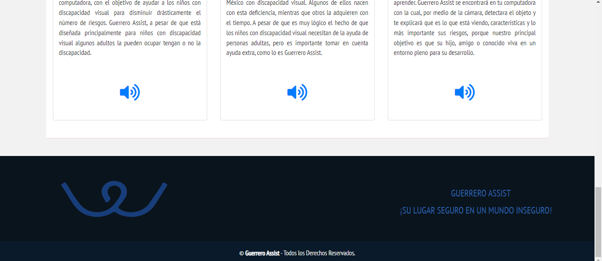
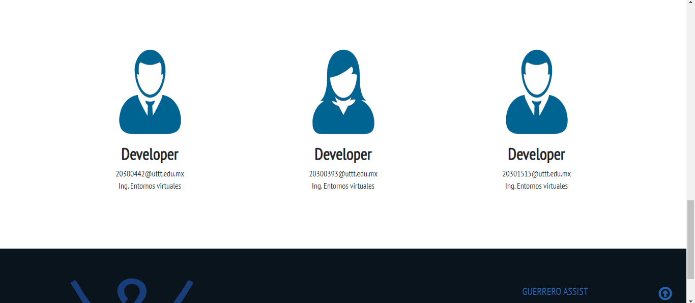
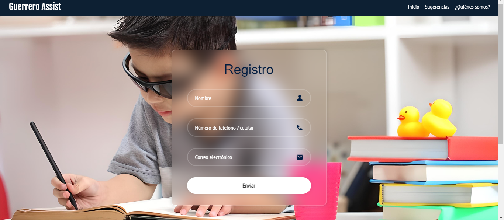

# Guerrero Assist
A continuación, se presenta una visualización del funcionamiento de Guerrero Assist. Las imágenes muestran el asistente virtual y detector de objetos para niños invidentes. 
Además, se muestra el sitio web desarrollado con HTML, CSS, JavaScript y Bootstrap, gestionado por PHP, XAMPP, PHPMyAdmin y MySQL. 
Las capturas incluyen las páginas de inicio, "Quiénes somos", registro y sugerencias, destacando la interacción y accesibilidad del proyecto.

